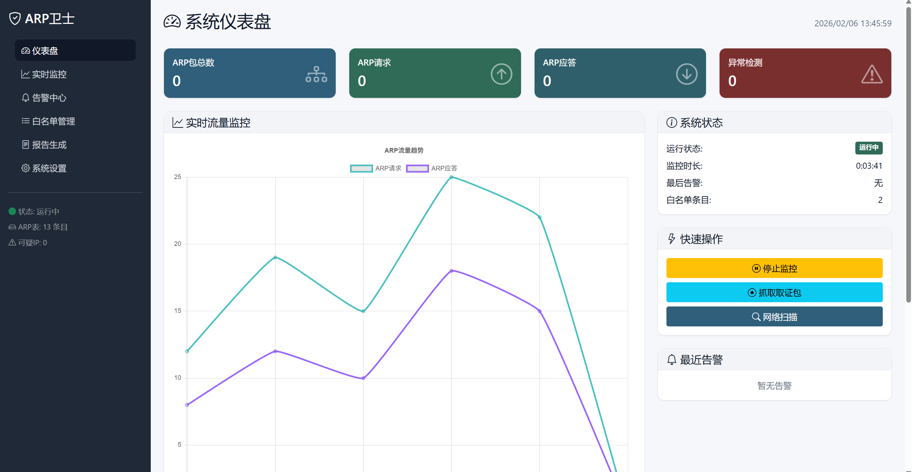
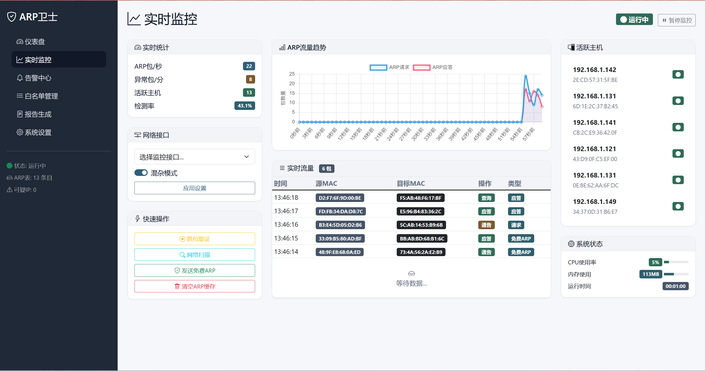
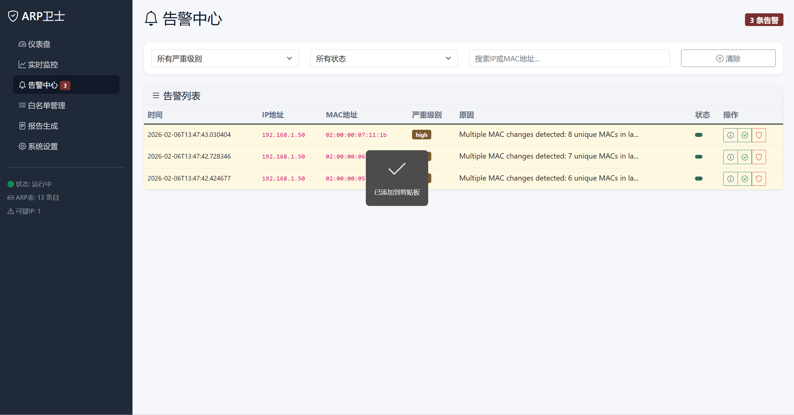
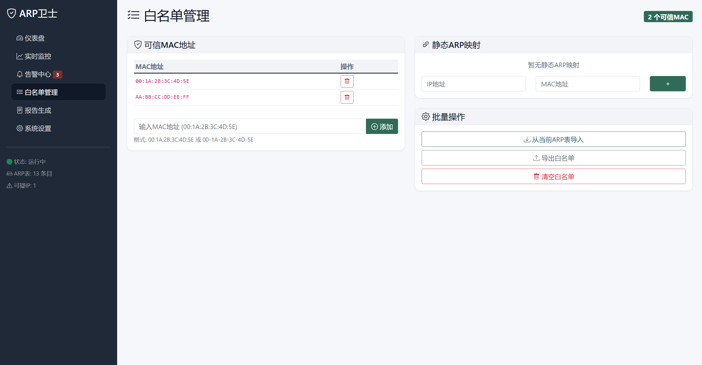
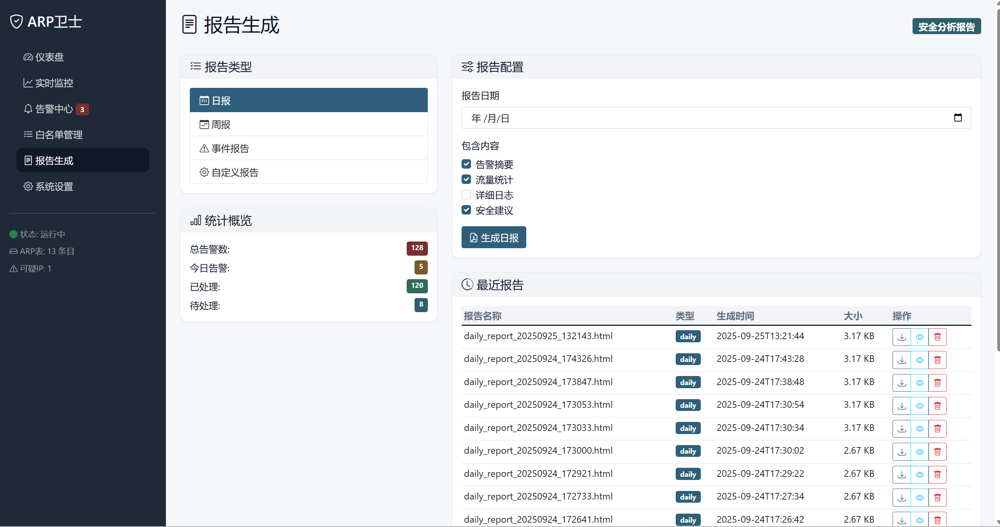
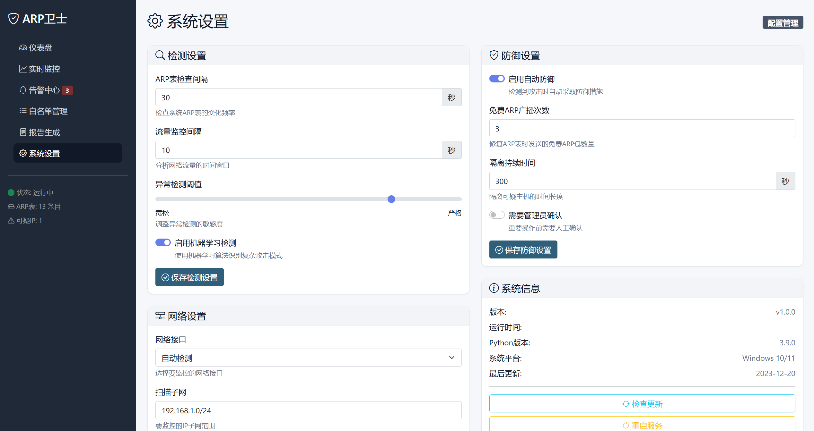

# 🛡️ ARP欺骗检测与防御系统
# 源码获取：https://mbd.pub/o/bread/YZWbk5prag==

<p align="center">
  
  
  
  
  
</p>

<p align="center">
  <b>基于机器学习的智能ARP欺骗检测与主动防御系统</b>
</p>

<p align="center">
  <a href="#-功能特性">功能特性</a> •
  <a href="#-系统截图">系统截图</a> •
  <a href="#-快速开始">快速开始</a> •
  <a href="#-技术架构">技术架构</a> •
  <a href="#-api文档">API文档</a> •
  <a href="#-贡献指南">贡献指南</a>
</p>

---

## 📋 目录

- [功能特性](#-功能特性)
- [系统截图](#-系统截图)
- [快速开始](#-快速开始)
- [技术架构](#-技术架构)
- [核心功能](#-核心功能)
- [API文档](#-api文档)
- [配置说明](#-配置说明)
- [性能指标](#-性能指标)
- [安全考虑](#-安全考虑)
- [贡献指南](#-贡献指南)
- [许可证](#-许可证)

---

## ✨ 功能特性

### 🔍 智能检测
- **实时ARP流量监控**：持续监控网络中的ARP请求和响应
- **多层检测机制**：结合规则检测和机器学习算法
- **异常行为分析**：基于DBSCAN无监督学习识别异常模式
- **自适应阈值**：根据网络环境动态调整检测参数

### 🛡️ 主动防御
- **自动阻断**：检测到攻击后自动隔离恶意主机
- **ARP表修复**：自动发送免费ARP包修复被污染的ARP表
- **白名单管理**：支持可信MAC地址和静态ARP映射
- **协作防御**：多主机协同监控和信息共享

### 📊 可视化界面
- **实时仪表盘**：直观的系统状态和流量趋势展示
- **告警中心**：集中管理安全告警和事件响应
- **报告生成**：自动生成日报、周报和安全分析报告
- **响应式设计**：支持桌面和移动设备访问

### 🔧 扩展能力
- **RESTful API**：提供完整的API接口
- **插件机制**：支持自定义检测算法和防御策略
- **多平台支持**：支持Windows、Linux、macOS
- **易于集成**：可与SIEM系统、网络设备集成

---

## 📸 系统截图

### 🏠 仪表盘
<p align="center">
  
</p>
<p align="center"><i>系统仪表盘 - 实时展示网络状态、流量趋势和告警信息</i></p>

**功能说明：**
- 系统状态概览：运行状态、ARP表大小、可疑主机数量
- 实时流量图表：ARP请求/应答趋势可视化
- 最近告警列表：快速查看最新安全事件
- 快速操作按钮：一键启动/停止监控、执行防御

---

### 📈 实时监控
<p align="center">
  
</p>
<p align="center"><i>实时监控页面 - 详细的流量数据和分析图表</i></p>

**功能说明：**
- 实时数据更新：每秒刷新网络流量数据
- 交互式图表：支持缩放、筛选、导出
- ARP表详情：查看当前ARP缓存表
- 流量统计：请求/应答数量、异常检测统计

---

### 🚨 告警中心
<p align="center">
  
</p>
<p align="center"><i>告警中心 - 集中管理和处理安全告警</i></p>

**功能说明：**
- 告警列表：按时间倒序显示所有告警
- 级别筛选：高/中/低级别告警分类查看
- 告警详情：查看完整的告警信息和上下文
- 处理状态：标记告警为已读/已处理
- 批量操作：支持批量处理和导出

---

### 📋 白名单管理
<p align="center">
  
</p>
<p align="center"><i>白名单管理 - 管理可信设备和静态ARP映射</i></p>

**功能说明：**
- 可信MAC管理：添加/删除可信MAC地址
- 静态ARP映射：配置IP-MAC绑定关系
- 批量导入：从当前ARP表批量导入白名单
- 导入导出：支持JSON格式导入导出
- 一键清空：快速清空白名单

---

### 📊 报告生成
<p align="center">
  
</p>
<p align="center"><i>报告生成 - 自动生成安全分析报告</i></p>

**功能说明：**
- 日报/周报：自动生成周期性安全报告
- 自定义报告：选择时间范围和内容
- 多种格式：支持HTML、PDF导出
- 历史报告：查看和下载历史报告
- 邮件发送：支持报告邮件推送

---

### ⚙️ 系统设置
<p align="center">
  
</p>
<p align="center"><i>系统设置 - 配置检测参数和防御策略</i></p>

**功能说明：**
- 检测参数：调整检测间隔、阈值等参数
- 防御策略：配置自动防御和响应策略
- 网络设置：选择监控网卡、配置子网
- 告警配置：设置告警级别和通知方式
- 系统日志：查看系统运行日志

---

## 🚀 快速开始

### 环境要求

| 项目 | 要求 |
|------|------|
| 操作系统 | Windows 7/8/10/11, Linux, macOS |
| Python | 3.7+ |
| 内存 | 4GB+ (推荐8GB) |
| 网络 | 局域网环境 |
| 权限 | 管理员权限（推荐） |

### 安装步骤

#### 1. 克隆仓库

```bash
git clone https://github.com/yourusername/arp-defense-system.git
cd arp-defense-system
```

#### 2. 安装依赖

```bash
pip install -r requirements.txt
```

#### 3. 配置系统

编辑 `config.py` 文件，根据实际网络环境调整配置：

```python
# 网络接口配置
NETWORK_INTERFACE = None  # 自动检测或手动指定
SCAN_SUBNET = "192.168.1.0/24"  # 默认扫描子网

# 白名单配置
TRUSTED_MACS = [
    "00:1A:2B:3C:4D:5E",
    "AA:BB:CC:DD:EE:FF"
]

# 防御配置
AUTO_DEFENSE_ENABLED = True
GRATUITOUS_ARP_COUNT = 3
```

#### 4. 启动系统

```bash
# Windows
python start.py

# Linux/macOS
python3 start.py
```

#### 5. 访问Web界面

打开浏览器访问：http://localhost:5000

---

## 🏗️ 技术架构

### 系统架构图

```
┌─────────────────┐    ┌─────────────────┐    ┌─────────────────┐
│   Web界面层     │    │   业务逻辑层    │    │   数据访问层    │
│                 │    │                 │    │                 │
│ • 仪表盘        │◄──►│ • ARP检测       │◄──►│ • 网络接口     │
│ • 监控页面      │    │ • ML检测        │    │ • 文件系统     │
│ • 告警中心      │    │ • 取证工具      │    │ • 数据库       │
│ • 设置页面      │    │ • 协作模块      │    │ • 模型存储     │
└─────────────────┘    └─────────────────┘    └─────────────────┘
         │                        │                        │
         ▼                        ▼                        ▼
┌─────────────────┐    ┌─────────────────┐    ┌─────────────────┐
│   用户交互层     │    │   处理引擎层     │    │   存储层        │
│                 │    │                 │    │                 │
│ • HTTP请求      │    │ • 多线程监控     │    │ • 抓包文件      │
│ • WebSocket     │    │ • 事件驱动       │    │ • 日志文件      │
│ • API调用       │    │ • 任务调度       │    │ • 配置文件      │
└─────────────────┘    └─────────────────┘    └─────────────────┘
```

### 技术栈

**后端技术**
- Python 3.7+ - 主要编程语言
- Flask 2.3.3 - Web框架
- Scapy 2.5.0 - 网络包处理
- Scikit-learn 1.3.0 - 机器学习
- Pandas 2.0.3 - 数据处理
- NumPy 1.24.3 - 数值计算

**前端技术**
- HTML5/CSS3 - 页面结构
- JavaScript - 交互逻辑
- Bootstrap 5 - UI框架
- Chart.js - 图表库
- Jinja2 - 模板引擎

---

## 🔧 核心功能

### 1. 实时ARP监控

```python
from scapy.all import sniff, ARP

class ARPDetector:
    def start_monitoring(self):
        """启动ARP监控"""
        self.running = True
        sniff(filter="arp", prn=self.arp_packet_handler, 
              store=False, timeout=30)
    
    def arp_packet_handler(self, packet):
        """处理ARP数据包"""
        if packet.haslayer(ARP):
            arp = packet[ARP]
            # 检测异常并处理
            self.detect_anomaly(arp)
```

### 2. 机器学习异常检测

```python
from sklearn.cluster import DBSCAN

class MLAnomalyDetector:
    def __init__(self):
        self.model = DBSCAN(eps=0.5, min_samples=5)
    
    def detect_anomaly(self, features):
        """检测异常"""
        scaled_features = self.scaler.transform([features])
        label = self.model.fit_predict(scaled_features)[0]
        
        if label == -1:  # 噪声点
            return 1.0  # 异常分数
        return 0.0
```

### 3. 主动防御机制

```python
def send_gratuitous_arp(self, ip, mac):
    """发送免费ARP包修复ARP表"""
    arp_packet = Ether(dst="ff:ff:ff:ff:ff:ff") / ARP(
        op=2, pdst=ip, hwdst="ff:ff:ff:ff:ff:ff",
        psrc=ip, hwsrc=mac
    )
    
    for _ in range(3):
        sendp(arp_packet, verbose=False)
        time.sleep(0.1)
```

---

## 📚 API文档

### 获取系统状态

```http
GET /api/status
```

**响应示例：**

```json
{
  "status": {
    "running": true,
    "arp_table_size": 25,
    "suspicious_count": 3
  },
  "stats": {
    "total_packets": 12345,
    "arp_requests": 6789,
    "arp_replies": 5556
  },
  "uptime": "2:30:45"
}
```

### 白名单管理

```http
GET /api/whitelist
```

```http
POST /api/whitelist
Content-Type: application/json

{
  "action": "add",
  "mac_address": "11:22:33:44:55:66"
}
```

### 告警查询

```http
GET /api/alerts
```

**响应示例：**

```json
{
  "success": true,
  "alerts": [
    {
      "id": "alert_1234567890",
      "type": "unauthorized_reply",
      "level": "high",
      "message": "检测到未授权的ARP应答",
      "timestamp": "2024-01-01T12:00:00"
    }
  ]
}
```

更多API文档请参考 [API_DOCUMENTATION.md](API_DOCUMENTATION.md)

---

## ⚙️ 配置说明

### 配置文件 config.py

```python
class Config:
    # 网络接口配置
    NETWORK_INTERFACE = None  # 自动检测
    SCAN_SUBNET = "192.168.1.0/24"
    
    # 检测参数
    ARP_TABLE_CHECK_INTERVAL = 30  # 秒
    TRAFFIC_MONITOR_INTERVAL = 10  # 秒
    ANOMALY_THRESHOLD = 0.8
    
    # 白名单配置
    WHITELIST_FILE = "whitelist.json"
    TRUSTED_MACS = []
    
    # 防御配置
    AUTO_DEFENSE_ENABLED = True
    GRATUITOUS_ARP_COUNT = 3
    QUARANTINE_DURATION = 300  # 秒
    
    # 告警配置
    ALERT_EMAIL = "admin@example.com"
    WEBHOOK_URL = "https://your-webhook.com"
```

---

## 📊 性能指标

| 指标 | 数值 | 说明 |
|------|------|------|
| 检测延迟 | < 1秒 | 从攻击发生到检测的时间 |
| 检测准确率 | > 95% | 正确识别攻击的比例 |
| 误报率 | < 5% | 正常流量被误判的比例 |
| 吞吐量 | > 1000包/秒 | 系统处理能力 |
| CPU占用 | < 10% | 正常监控时的CPU使用率 |
| 内存占用 | < 200MB | 系统内存占用 |

---

## 🔒 安全考虑

### 系统安全

- **权限控制**：需要管理员权限捕获网络包
- **数据保护**：敏感信息加密存储
- **访问控制**：Web界面支持登录认证
- **日志审计**：完整的操作日志记录

### 网络安全

- **最小权限**：只进行必要的网络操作
- **数据验证**：所有输入数据严格验证
- **错误处理**：完善的异常处理机制
- **防御测试**：充分测试后再部署


